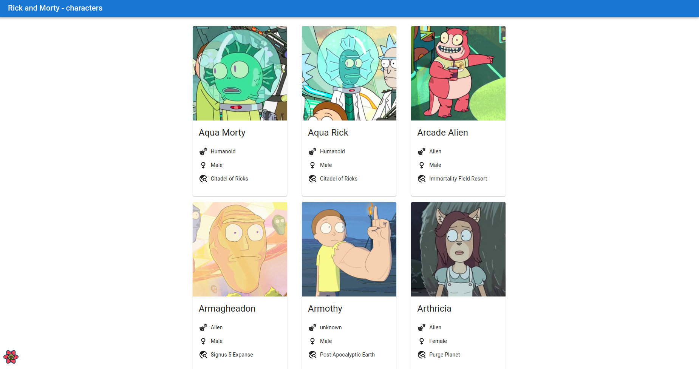

# Rick and Morty Characters

- The application was build using ReactJs & Material UI and some other 3rd party packages ( package.json )
- The characters are coming from the [RickAndMortyApi](https://rickandmortyapi.com/)

### Run locally

- After cloning the repo, cd into the directory then run `npm install` to install all dependencies
- Then `npm start`

### Screenshot

